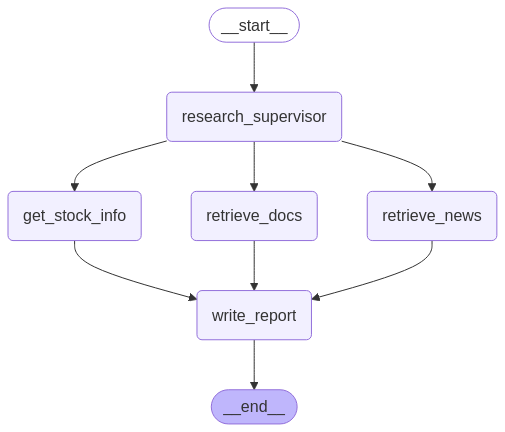
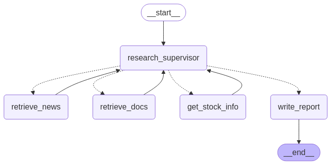

# Market Analysis Agent

## 초기 개발 구조


## 개별 Agent 노드 구현 후 Supervisor Agent 로직 고도화


## 파일구조
```bash
/
├── .env                        # 개인별 API Key등 환경변수 설정
├── requirements.txt            # 필수 라이브러리 (각자 활용한 라이브러리 추가 필요)
├── main.py                     # 전체 워크플로우 정의
├── main_test.ipynb             # 주피터 노트북 활용 결과물 테스트 및 시각화
├── common/dddddd
│   └── state_graph.py          # GraphState 클래스 등 정의
└── nodes/                      # 각 노드별 모듈 디렉토리
    ├── research_supervisor/
    │   ├── __init__.py         
    │   └── research_supervisor.py  # 시장분석 에이전트팀 총괄 및 결과물 검사
    ├── retrieve_news/
    │   ├── __init__.py         
    │   └── retrieve_news.py    # 뉴스 검색 및 요약
    ├── retrieve_docs/
    │   ├── __init__.py         
    │   └── retrieve_docs.py    # 문서(증권사 리포트) 검색 및 분석
    ├── get_stock_info/
    │   ├── __init__.py        
    │   └── get_stock_info.py    # 한국투자증권 API 활용 종목 정보 수집 및 분석
    └── write_report/
        ├── __init__.py        
        └── write_report.py     # 보고서 작성(답변 생성)
```

## Framework
- LangGraph 활용


## License
This project is licensed under the [MIT License](https://opensource.org/licenses/MIT).
